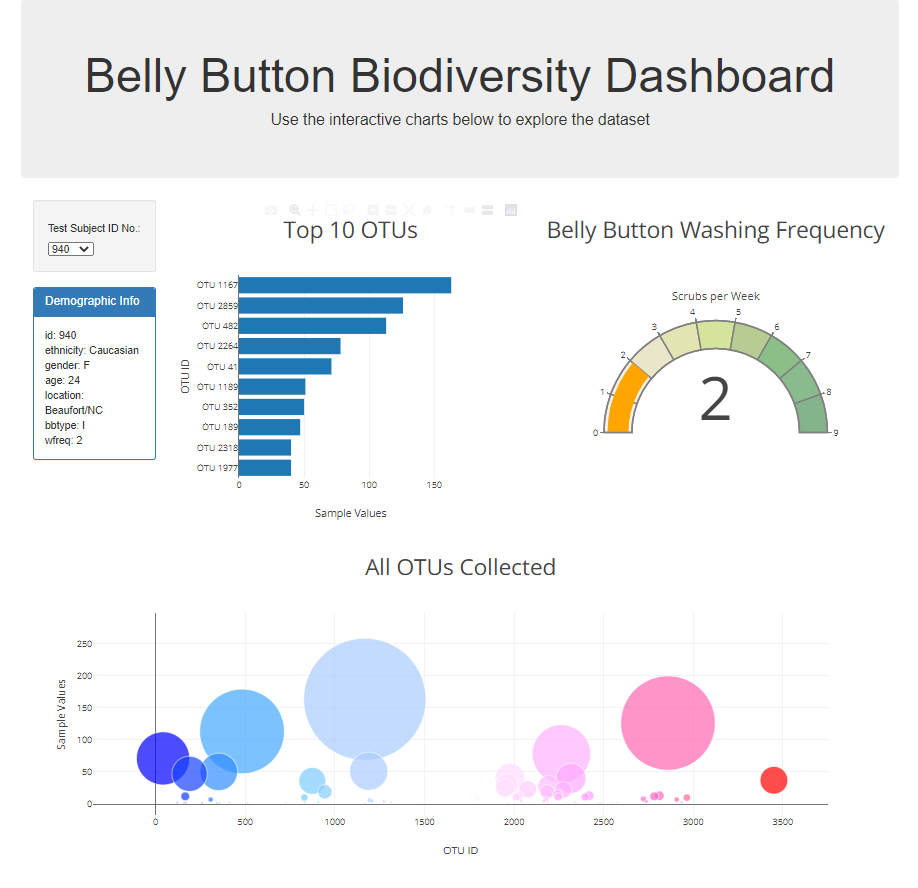

# GT Bootcamp Plotly Homework: Belly Button Biodiversity

## Table of Contents
1. [Introduction](#introduction)
2. [Objectives](#objectives)
3. [Technologies & Sources](#technologies)
4. [Files](#files)

### Introduction
In this assignment, I have been tasked with building an interactive dashboard that visualizes data in different ways. I am using the Belly Button Biodiversity dataset, which is a catalog of microbes found in navels of various human test subjects.

### Objectives
Visualize the provided dataset by creating:
* A dynamic dashboard that changes based on the selected test subject id
* A horizontal bar chart to show the top 10 OTUs in the test subject
* A demographic info blurb that lists all provided demographic info on the test subject
* A gauge chart that shows the number of times the subject washes their belly button per week
* A bubble chart that shows all OTUs collected in the test subject and sized by the amount collected

### Technologies & Sources
This project uses: 
* Bootstrap Version 3.3.7
* Plotly
* Javascript
* HTML
* D3.json

### Files

* [Belly Button Data File](data/samples.json): provided file (in JSON format) that contains data collected in the belly button biodiversity study
* [Javascript File](static/js/app.js): file containing all javascript code used for the webpage; initialized the drop down and visualizations as well as updates visualizations as new options are chosen on the drop down
* [Webpage HTML](index.html): HTML for the dashboard page, which is created using Bootstrap, Plotly, and Javascript dynamic coding

#### Screenshot of Dashboard Web Page
